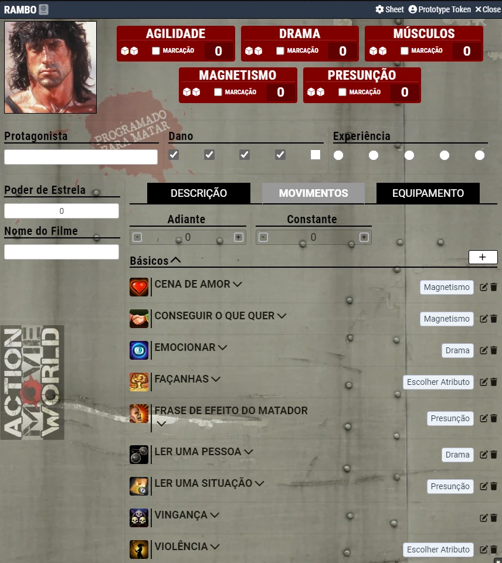

# Action World Movie - Português (Brasil)
**Módulo para Action World Movie em Português (Brasil)**

<table>
<thead>
  <tr>
    <th>
      

        
      

    </th>
  </tr>
</thead>
</table>

# Aprenda!
https://youtu.be/HWh4sbjg1ww

# Instalação
Instale o manifesto: https://raw.githubusercontent.com/brunocalado/action-world-movie-pt-br/main/module.json

# Como Usar
- Abra o arquivo de [configuração](https://github.com/brunocalado/action-world-movie-pt-br/raw/main/template/ActionWorldMovie.txt), copie o texto e cole na tela de configuração do sistema PBTA.
- Instale e ative esse módulo.
- Altere o idioma em configurações para Português (Brasil).
- Vá em compêndios de aventura e importe o compêndio **Action World Movie**. Você terá no mundo os movimentos básicos para os personagens.
- Crie um ator. Arrasta a **pasta** de Movimentos Básicos para o ator.

# Onde Obter

Obtenha grátis em: ?

# Credits/License

